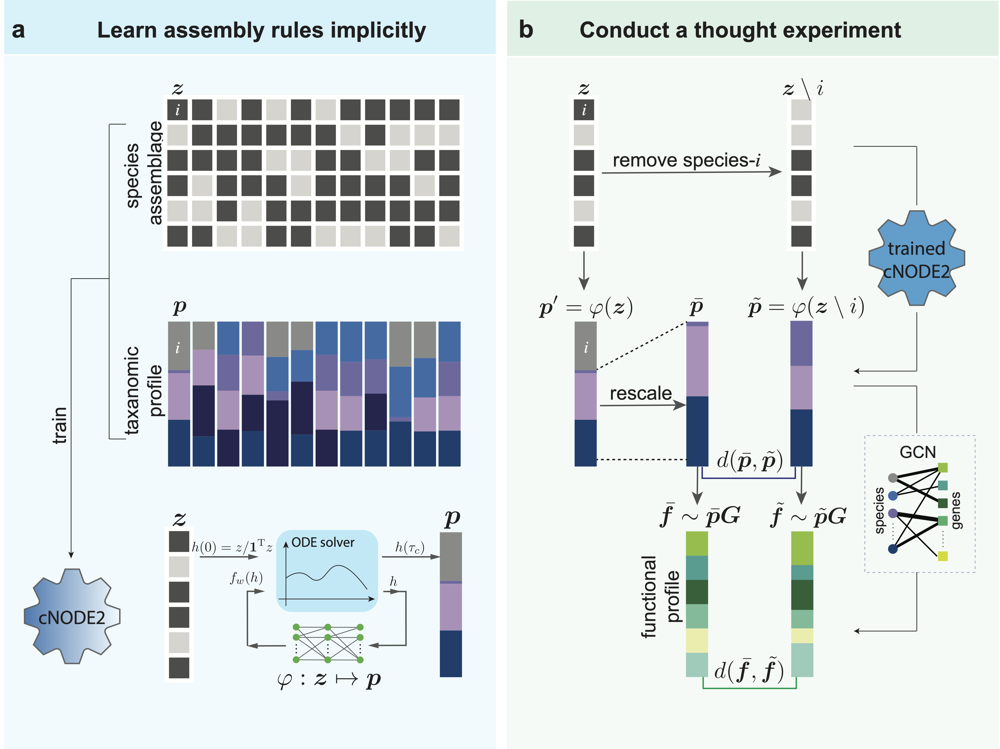

# DKI (Data-driven Keystone species Identification)
This is a Pytorch implementation of DKI, as described in our paper:

Wang, X.W., Sun, Z., Jia, H., Michel-Mata, S., Angulo, M.T., Dai, L., He, X., Weiss, S.T. and Liu, Y.Y. [Identifying keystone species in microbial communities using deep learning]. bioRxiv, pp.2023-03 (2023). 

  

We have tested this code for Python 3.8.13 and R 4.1.2.

## Contents

- [Overview](#overview)
- [Repo Contents](#repo-contents)
- [Data type for DKI](#Data-type-for-DKI)
- [How the use the DKI framework](#How-the-use-the-DKI-framework)

# Overview

Previous studies suggested that microbial communities harbor keystone species whose removal can cause a dramatic shift in microbiome structure and functioning. Yet, an efficient method to systematically identify keystone species in microbial communities is still lacking. This is mainly due to our limited knowledge of microbial dynamics and the experimental and ethical difficulties of manipulating microbial communities. Here, we propose a Data-driven Keystone species Identification (DKI) framework based on deep learning to resolve this challenge. Our key idea is to implicitly learn the assembly rules of microbial communities from a particular habitat by training a deep learning model using microbiome samples collected from this habitat. The well-trained deep learning model enables us to quantify the community-specific keystoneness of each species in any microbiome sample from this habitat by conducting a thought experiment on species removal. We systematically validated this DKI framework using synthetic data generated from a classical population dynamics model in community ecology. We then applied DKI to analyze human gut, oral microbiome, soil, and coral microbiome data. We found that those taxa with high median keystoneness across different communities display strong community specificity, and many of them have been reported as keystone taxa in literature. The presented DKI framework demonstrates the power of machine learning in tackling a fundamental problem in community ecology, paving the way for the data-driven management of complex microbial communities.

# Repo Contents
(1) A synthetic dataset to test the Data-driven Keystone species Identification (DKI) framework.

(2) Python code to predict the species composition using species assemblage (cNODE2) and R code to compute keystoneness.

(3) Predicted species composition after removing each present species in each sample.

# Data type for DKI
## (1) Ptrain.csv: matrix of taxanomic profile of size N*M, where N is the number of taxa and M is the sample size (without header).

|           | sample 1 | sample 2 | sample 3 | sample 4 |
|-----------|----------|----------|----------|----------|
| species 1 | 0.45     | 0.35     | 0.86     | 0.77     |
| species 2 | 0.51     | 0        | 0        | 0        |
| species 3 | 0        | 0.25     | 0        | 0        |
| species 4 | 0        | 0        | 0.07     | 0        |
| species 5 | 0        | 0        | 0        | 0.17     |
| species 6 | 0.04     | 0.4      | 0.07     | 0.06     |

## (2) Thought experiment: thought experiemt was realized by removing each present species in each sample. This will generated three data type.

* Ztest.csv: matrix of perturbed species collection of size N*C, where N is the number of taxa and C is the total perturbed samples (without header).

|           | sample 1 | sample 2 | sample 3 | sample 4 | sample 5 | sample 6 | sample 7 | sample 8 | sample 9 | sample 10 | sample 11 | sample 12 |
|-----------|----------|----------|----------|----------|----------|----------|----------|----------|----------|-----------|-----------|-----------|
| species 1 | 0        | 1        | 1        | 0        | 1        | 1        | 0        | 1        | 1        | 0         | 1         | 1         |
| species 2 | 1        | 0        | 1        | 0        | 0        | 0        | 0        | 0        | 0        | 0         | 0         | 0         |
| species 3 | 0        | 0        | 0        | 1        | 0        | 1        | 0        | 0        | 0        | 0         | 0         | 0         |
| species 4 | 0        | 0        | 0        | 0        | 0        | 0        | 1        | 0        | 1        | 0         | 0         | 0         |
| species 5 | 0        | 0        | 0        | 0        | 0        | 0        | 0        | 0        | 0        | 1         | 0         | 1         |
| species 6 | 1        | 1        | 0        | 1        | 1        | 0        | 1        | 1        | 0        | 1         | 1         | 0         |

* Species_id: a list indicating which species has been removed in each sample.

| species |
|---------|
| 1       |
| 2       |
| 6       |
| 1       |
| 3       |
| 6       |
| 1       |
| 4       |
| 6       |
| 1       |
| 5       |
| 6       |

* Sample_id: a list indicating which sample that the species been removed.

| sample |
|--------|
| 1      |
| 1      |
| 1      |
| 2      |
| 2      |
| 2      |
| 3      |
| 3      |
| 3      |
| 4      |
| 4      |
| 4      |

# How the use the DKI framework
## Step 1: Predict species compostion using perturbed species assemblage
Run Python code "DKI.py" by taking Ptrain.csv and Ztest.csv as input will output the predicted microbiome composition using perturbed species colloction matrix Ztest.csv.
The output file qtst.csv:

|           | sample 1  | sample 2  | sample 3  | sample 4   | sample 5   | sample 6   | sample 7   | sample 8  | sample 9  | sample 10  | sample 11  | sample 12 |
|-----------|-----------|-----------|-----------|------------|------------|------------|------------|-----------|-----------|------------|------------|-----------|
| species 1 | 0.0000000 | 0.000000  | 0.0000000 | 0.92458308 | 0.92458308 | 0.92458308 | 0.9245831  | 0.4725695 | 0.4729691 | 0.91488211 | 0.8053058  | 0.8053058 |
| species 2 | 0.8315174 | 0.0000000 | 0.000000  | 0.0000000  | 0.00000000 | 0.00000000 | 0.00000000 | 0.0000000 | 0.5274305 | 0.0000000  | 0.00000000 | 0.0000000 |
| species 3 | 0.0000000 | 0.8287832 | 0.000000  | 0.0000000  | 0.00000000 | 0.00000000 | 0.00000000 | 0.0000000 | 0.0000000 | 0.5270309  | 0.00000000 | 0.0000000 |
| species 4 | 0.0000000 | 0.0000000 | 0.212941  | 0.0000000  | 0.00000000 | 0.00000000 | 0.00000000 | 0.0000000 | 0.0000000 | 0.0000000  | 0.08511789 | 0.0000000 |
| species 5 | 0.0000000 | 0.0000000 | 0.000000  | 0.4444696  | 0.00000000 | 0.00000000 | 0.00000000 | 0.0000000 | 0.0000000 | 0.0000000  | 0.00000000 | 0.1946942 |
| species 6 | 0.1684826 | 0.1712168 | 0.787059  | 0.5555304  | 0.07541692 | 0.07541692 | 0.07541692 | 0.0754169 | 0.0000000 | 0.0000000  | 0.00000000 | 0.0000000 |

## Step 2: Compute the keystoneness
Run R code Keystoneness_computing.R to compute the keystonenss of each present in each sample. The output file:

| keystoneness | sample | species |
|--------------|--------|---------|
| 5.576585e-02 | 1      | 1       |
| 5.680769e-02 | 2      | 1       |
| 4.133107e-02 | 3      | 1       |
| 6.768209e-02 | 4      | 1       |
| 3.948267e-05 | 1      | 2       |
| 4.027457e-05 | 2      | 3       |
| 7.398025e-05 | 3      | 4       |
| 5.262661e-05 | 4      | 5       |
| 4.576021e-03 | 1      | 6       |
| 3.072820e-03 | 2      | 6       |
| 7.672017e-03 | 3      | 6       |
| 1.067806e-02 | 4      | 6       |

Each row represent the keystonenes of a species in a particular sample.

